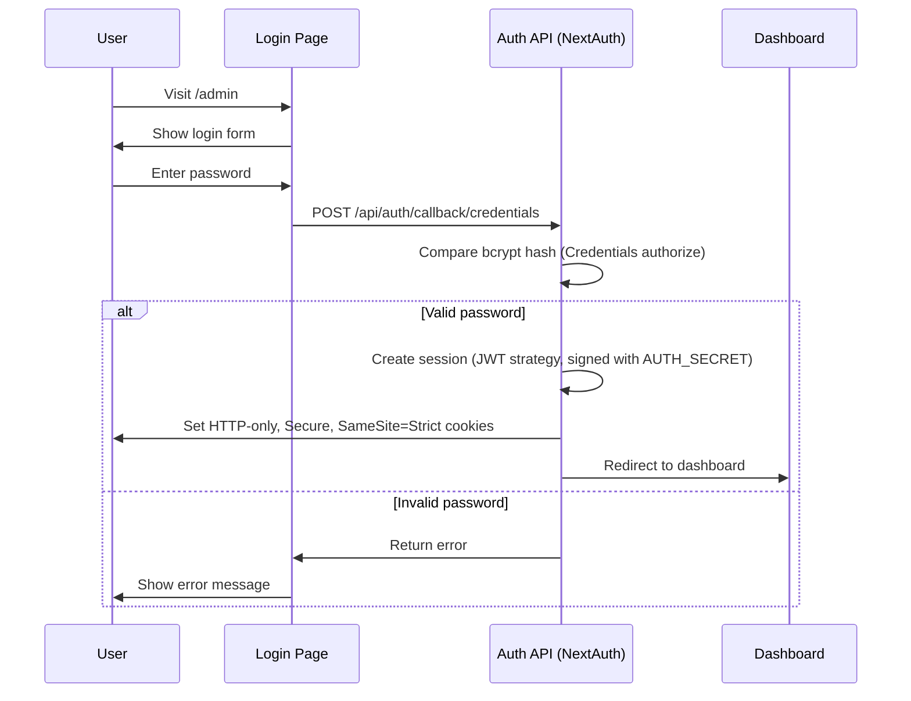
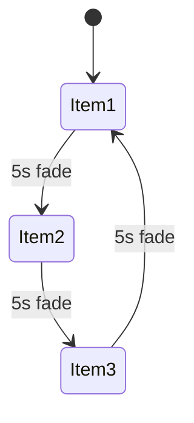

# Admin Panel Integration Plan

## Overview

A password-protected admin panel at `/admin` allowing band members to manage shows and merch content without technical knowledge. Built with security, maintainability, and scalability as primary concerns.

## Technology Choices

| Concern | Solution | Rationale |
|---------|----------|-----------|
| **Database** | Turso (libSQL) | Edge-compatible, serverless, free tier, SQL injection protection via parameterized queries |
| **Images** | URL input fields | No file upload vulnerabilities, band can use any image host |
| **Auth** | Auth.js (NextAuth) with Credentials | Maintained auth flow, built-in CSRF for sign-in, secure cookies |
| **Password** | bcrypt hashing | Industry standard, timing-attack resistant comparison |
| **Validation** | Zod schemas | Already in use, consistent with codebase |

---

## Architecture

### System Flow

```mermaid
flowchart TB
    subgraph Public Site
        A[Home Page] --> B[Shows Page]
        A --> C[Merch Page]
    end

    subgraph Admin Panel
        D[/admin Login] --> E{Valid Password?}
        E -->|Yes| F[Admin Dashboard]
        E -->|No| D
        F --> G[Manage Shows]
        F --> H[Manage Merch]
    end

    subgraph Database
        I[(Turso DB)]
    end

    G -->|CRUD| I
    H -->|CRUD| I
    B -->|Read| I
    C -->|Read| I
    A -->|Read| I
```

### Authentication Flow (Auth.js / NextAuth)



---

## Data Schemas

### Extended Show Schema

```typescript
// src/content/schema.ts
export const showSchema = z.object({
  id: z.string().uuid(),
  date: z.string().datetime(),      // ISO 8601 UTC (Z)
  venue: z.string().min(1),
  city: z.string().min(1),
  price: z.string().optional(),     // NEW: e.g. "R150" or "Free"
  ticketUrl: z.string().url().optional(),
  imageUrl: z.string().url().optional(), // NEW: venue/event image
  createdAt: z.string().datetime(),
  updatedAt: z.string().datetime(),
});
```

### Extended Merch Schema

```typescript
export const merchItemSchema = z.object({
  id: z.string().uuid(),
  name: z.string().min(1),
  description: z.string().optional(), // NEW: item description
  price: z.string().min(1),           // NOW REQUIRED
  href: z.string().url(),
  imageUrl: z.string().url().optional(), // NEW: product image
  createdAt: z.string().datetime(),
  updatedAt: z.string().datetime(),
});
```

### Database Tables

```sql
-- Shows table
CREATE TABLE shows (
  id TEXT PRIMARY KEY,
  date TEXT NOT NULL, -- store in UTC ISO 8601 (Z) for ordering
  venue TEXT NOT NULL,
  city TEXT NOT NULL,
  price TEXT,
  ticket_url TEXT,
  image_url TEXT,
  created_at TEXT NOT NULL DEFAULT (datetime('now')),
  updated_at TEXT NOT NULL DEFAULT (datetime('now'))
);

-- Merch table
CREATE TABLE merch (
  id TEXT PRIMARY KEY,
  name TEXT NOT NULL,
  description TEXT,
  price TEXT NOT NULL,
  href TEXT NOT NULL,
  image_url TEXT,
  created_at TEXT NOT NULL DEFAULT (datetime('now')),
  updated_at TEXT NOT NULL DEFAULT (datetime('now'))
);

-- Optional audit log (recommended)
CREATE TABLE admin_audit (
  id TEXT PRIMARY KEY,
  actor TEXT NOT NULL,             -- e.g. "admin"
  action TEXT NOT NULL,            -- create/update/delete
  entity TEXT NOT NULL,            -- shows/merch
  entity_id TEXT NOT NULL,
  created_at TEXT NOT NULL DEFAULT (datetime('now')),
  details TEXT                     -- JSON string
);
```

---

## File Structure

```
src/
├── app/
│   ├── admin/
│   │   ├── layout.tsx          # Admin layout with auth check
│   │   ├── page.tsx            # Login page
│   │   ├── dashboard/
│   │   │   └── page.tsx        # Dashboard with overview
│   │   ├── shows/
│   │   │   ├── page.tsx        # Shows list
│   │   │   ├── new/page.tsx    # Create show form
│   │   │   └── [id]/page.tsx   # Edit show form
│   │   └── merch/
│   │       ├── page.tsx        # Merch list
│   │       ├── new/page.tsx    # Create merch form
│   │       └── [id]/page.tsx   # Edit merch form
│   └── api/
│       └── auth/
│           └── [...nextauth]/route.ts   # Auth.js route handler
├── components/
│   ├── admin/
│   │   ├── AdminNav.tsx        # Admin navigation
│   │   ├── ShowForm.tsx        # Show create/edit form
│   │   ├── MerchForm.tsx       # Merch create/edit form
│   │   └── DeleteButton.tsx    # Confirmation delete button
│   ├── MerchCarousel.tsx       # NEW: Cycling merch display
│   └── UpcomingShow.tsx        # NEW: Next show card
├── lib/
│   ├── db.ts                   # Turso client setup
│   └── admin-actions.ts        # Server actions for forms
├── auth.ts                     # Auth.js (NextAuth) config
└── middleware.ts               # Auth middleware for /admin/*
```

---

## Environment Variables

Add to `.env`:

```bash
# Admin authentication (REQUIRED)
ADMIN_PASSWORD_HASH=           # bcrypt hash of admin password
AUTH_SECRET=                   # high-entropy secret for Auth.js
AUTH_URL=                      # canonical site URL for Auth.js (e.g., https://example.com)

# Turso database (REQUIRED)
TURSO_DATABASE_URL=            # libsql://your-db.turso.io
TURSO_AUTH_TOKEN=              # Turso auth token

# Existing
NEXT_PUBLIC_SITE_URL=
```

Add to `env.example`:

```bash
# Admin Panel
# Generate hash: npx bcrypt-cli hash "your-password" 12
ADMIN_PASSWORD_HASH=
AUTH_SECRET=
AUTH_URL=

# Turso Database - Get from https://turso.tech/app
TURSO_DATABASE_URL=
TURSO_AUTH_TOKEN=
```

---

## Security Measures

### 1. Password Storage
- Never store plaintext passwords
- Use bcrypt with cost factor 12
- Timing-safe comparison via `bcrypt.compare()`

### 2. Session Management
- Auth.js sessions signed with `AUTH_SECRET`
- HTTP-only cookies prevent XSS access
- `SameSite=Strict`, `Secure`, `Path=/` (prefer `__Host-` cookies if possible)
- 24-hour expiry with no refresh (configure `session.maxAge`)

### 3. Route Protection
- Use `auth()` in Server Actions and admin pages; unauthenticated users redirect to `/admin`
- Protect `/admin/*` in `middleware.ts` using Auth.js helpers
- Enforce login rate limits in the Credentials authorize function (e.g., 5 attempts / 15 min / IP)

### 4. Input Validation
- All inputs validated with Zod schemas
- URLs validated as proper URLs
- Dates validated as ISO 8601
- For image URLs, use an allowlist if server-side fetching/Next Image is enabled
- Parameterized SQL queries (no string interpolation)

### 5. CSRF Protection
- Auth.js provides CSRF protection for credential sign-in
- Use Server Actions for admin mutations (Next.js built-in CSRF)
- If Route Handlers are used for mutations, enforce Origin/Referer checks

### 6. Audit Logging
- Write create/update/delete actions to `admin_audit`
- Use audit entries to power "recent activity" on the dashboard

---

## Admin UI Design

Following the existing dark monochrome aesthetic:

### Login Page
- Centered card with password input
- Error message display for failed attempts
- No username field (single admin account)

### Dashboard
- Overview cards showing counts
- Quick links to manage shows/merch
- Recent activity (last 5 items modified)

### List Views
- Table layout with sortable columns
- Delete confirmation modal
- Inline status indicators (e.g., past vs upcoming shows)

### Forms
- Clear labels with placeholder examples
- Image URL with preview (client-side only; no server fetch)
- Date picker for shows
- Validation feedback on submit

---

## Home Page Updates

### Merch Card Cycling

The merch card in [`HomeCarousel`](src/components/HomeCarousel.tsx:44) will:

1. Fetch all merch items with images
2. Display one item at a time with slow crossfade
3. Cycle every 5 seconds (respecting `prefers-reduced-motion`)
4. Show item image, name, and price
5. Link to `/merch` page on click



### Upcoming Show Display

The shows card will:

1. Query for the soonest future show (compare in UTC)
2. Display venue, city, date, and image
3. Show price if available
4. Link to `/shows` page on click

---

## Migration Strategy

### Phase 1: Database Setup
1. Create Turso account and database
2. Install `@libsql/client` package
3. Run schema migrations
4. Migrate existing JSON data to database

### Phase 2: API Migration
1. Update content loaders to read from database
2. Keep JSON files as fallback during transition
3. Add cache invalidation on mutations

### Phase 3: Admin Panel
1. Build authentication system
2. Create CRUD forms and API routes
3. Test all operations

### Phase 4: Frontend Updates
1. Update HomeCarousel with cycling/upcoming features
2. Update shows/merch pages to use new fields
3. Add image display where applicable

---

## Implementation Checklist

### Database Setup
- [ ] Create Turso account and database
- [ ] Install `@libsql/client` dependency
- [ ] Create `src/lib/db.ts` with client configuration
- [ ] Create database schema with shows and merch tables
- [ ] Create `admin_audit` table for logging changes
- [ ] Create migration script to import existing JSON data
- [ ] Update `src/content/shows.ts` to read from database
- [ ] Update `src/content/merch.ts` to read from database

### Authentication System (Auth.js / NextAuth)
- [ ] Add `ADMIN_PASSWORD_HASH`, `AUTH_SECRET`, `AUTH_URL` and Turso env vars to `env.example`
- [ ] Install `next-auth` and `bcryptjs` (or force Node runtime if using `bcrypt`)
- [ ] Create `src/auth.ts` with Credentials provider (single admin account)
- [ ] Add `src/app/api/auth/[...nextauth]/route.ts`
- [ ] Create `src/middleware.ts` to protect admin routes
- [ ] Add login rate limiting in the Credentials authorize flow
- [ ] Create admin login page at `src/app/admin/page.tsx` (custom sign-in)

### Admin Dashboard
- [ ] Create `src/app/admin/layout.tsx` with auth check
- [ ] Create `src/app/admin/dashboard/page.tsx` with overview
- [ ] Create `src/components/admin/AdminNav.tsx`
- [ ] Populate "recent activity" from `admin_audit`

### Shows Management
- [ ] Update Zod schema with new show fields
- [ ] Add shows CRUD Server Actions in `src/lib/admin-actions.ts`
- [ ] Create `src/app/admin/shows/page.tsx` (list view)
- [ ] Create `src/app/admin/shows/new/page.tsx` (create form)
- [ ] Create `src/app/admin/shows/[id]/page.tsx` (edit form)
- [ ] Create `src/components/admin/ShowForm.tsx`

### Merch Management
- [ ] Update Zod schema with new merch fields
- [ ] Add merch CRUD Server Actions in `src/lib/admin-actions.ts`
- [ ] Create `src/app/admin/merch/page.tsx` (list view)
- [ ] Create `src/app/admin/merch/new/page.tsx` (create form)
- [ ] Create `src/app/admin/merch/[id]/page.tsx` (edit form)
- [ ] Create `src/components/admin/MerchForm.tsx`

### Home Page Updates
- [ ] Create `src/components/MerchCarousel.tsx` for cycling display
- [ ] Create `src/components/UpcomingShow.tsx` for next show
- [ ] Update `src/components/HomeCarousel.tsx` to use new components
- [ ] Add reduced motion support for cycling animation

### Testing & Documentation
- [ ] Add tests for auth utilities
- [ ] Add tests for API routes
- [ ] Add tests for admin components
- [ ] Update `AGENTS.md` with admin panel documentation
- [ ] Update `README.md` with setup instructions

---

## Non-Technical User Guide

*(To be written after implementation)*

This section will include:
- How to access the admin panel
- How to add a new show
- How to add new merch
- How to edit or delete items
- Image URL best practices
- Troubleshooting common issues
