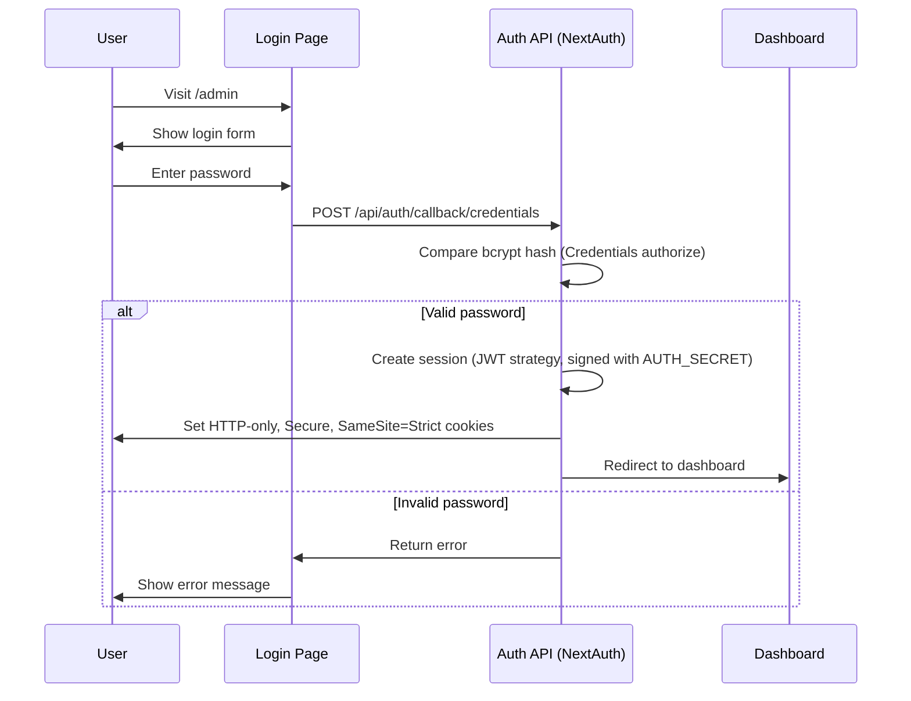
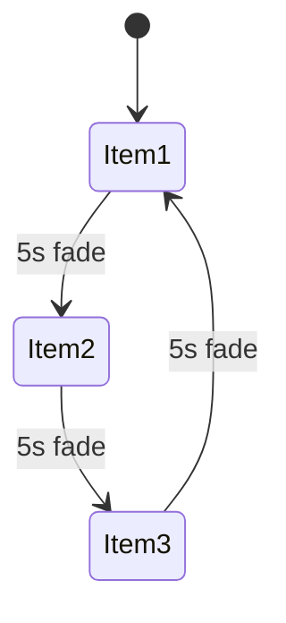

# Admin Panel Integration Plan (In-Project Storage)

## Overview

A password-protected admin panel at `/admin` allowing band members to manage shows and merch content without technical knowledge. Built with security, maintainability, and a **no-external-dependencies** approach.

## Recommended Method (Better In-Project Approach)

Use the existing `content/` JSON files as the **single source of truth**, and add an admin UI that reads/writes those files via server actions. This avoids external databases and keeps the workflow fully in-project.

**Why this is better for the stated goal:**
- **No external services or credentials** to manage
- **Matches the current content system** and Zod validation
- **Easy backups and rollbacks** via JSON file history or git
- **Minimal operational complexity** while still enabling CRUD

---

## Technology Choices

| Concern | Solution | Rationale |
|---------|----------|-----------|
| **Storage** | In-project JSON (`content/*.json`) | Already the content source, zero external dependencies, easy to validate and back up |
| **Images** | URL input fields | No file upload vulnerabilities, band can use any image host |
| **Auth** | Auth.js (NextAuth) with Credentials | Maintained auth flow, built-in CSRF for sign-in, secure cookies |
| **Password** | bcrypt hashing | Industry standard, timing-attack resistant comparison |
| **Validation** | Zod schemas | Already in use, consistent with codebase |
| **Writes** | Server Actions + atomic file writes | Avoids API boilerplate, prevents partial writes |

---

## Architecture

### System Flow

```mermaid
flowchart TB
    subgraph Public Site
        A[Home Page] --> B[Shows Page]
        A --> C[Merch Page]
    end

    subgraph Admin Panel
        D[/admin Login] --> E{Valid Password?}
        E -->|Yes| F[Admin Dashboard]
        E -->|No| D
        F --> G[Manage Shows]
        F --> H[Manage Merch]
    end

    subgraph Content Store
        I[(content/shows.json)]
        J[(content/merch.json)]
        K[(content/admin-audit.json)]
    end

    G -->|CRUD| I
    H -->|CRUD| J
    G -->|Audit| K
    H -->|Audit| K
    B -->|Read| I
    C -->|Read| J
    A -->|Read| I
    A -->|Read| J
```

### Authentication Flow (Auth.js / NextAuth)



---

## Data Schemas

### Extended Show Schema

```typescript
// src/content/schema.ts
export const showSchema = z.object({
  id: z.string().uuid(),
  date: z.string().datetime(),      // ISO 8601 with timezone
  venue: z.string().min(1),
  city: z.string().min(1),
  price: z.string().optional(),     // NEW: e.g. "R150" or "Free"
  ticketUrl: z.string().url().optional(),
  imageUrl: z.string().url().optional(), // NEW: venue/event image
  createdAt: z.string().datetime(),
  updatedAt: z.string().datetime(),
});
```

### Extended Merch Schema

```typescript
export const merchItemSchema = z.object({
  id: z.string().uuid(),
  name: z.string().min(1),
  description: z.string().optional(), // NEW: item description
  price: z.string().min(1),           // NOW REQUIRED
  href: z.string().url(),
  imageUrl: z.string().url().optional(), // NEW: product image
  createdAt: z.string().datetime(),
  updatedAt: z.string().datetime(),
});
```

### Audit Log Schema (JSON File)

```typescript
export const adminAuditSchema = z.object({
  id: z.string().uuid(),
  actor: z.string().min(1),        // e.g. "admin"
  action: z.enum(["create", "update", "delete"]),
  entity: z.enum(["shows", "merch"]),
  entityId: z.string().uuid(),
  createdAt: z.string().datetime(),
  details: z.string().optional(),  // JSON string (diff or snapshot)
});
```

---

## File Structure

```
src/
├── app/
│   ├── admin/
│   │   ├── (protected)/
│   │   │   ├── layout.tsx          # Admin layout with auth check
│   │   │   ├── dashboard/
│   │   │   │   └── page.tsx        # Dashboard with overview
│   │   │   ├── shows/
│   │   │   │   └── page.tsx        # Shows list (placeholder)
│   │   │   └── merch/
│   │   │       └── page.tsx        # Merch list (placeholder)
│   │   └── page.tsx                # Login page
│   └── api/
│       └── auth/
│           └── [...nextauth]/route.ts   # Auth.js route handler
├── components/
│   ├── admin/
│   │   ├── AdminNav.tsx        # Admin navigation
│   │   ├── ShowForm.tsx        # Show create/edit form
│   │   ├── MerchForm.tsx       # Merch create/edit form
│   │   └── DeleteButton.tsx    # Confirmation delete button
│   ├── MerchCarousel.tsx       # NEW: Cycling merch display
│   └── UpcomingShow.tsx        # NEW: Next show card
├── lib/
│   ├── content-store.ts        # Read/write JSON + atomic writes
│   ├── admin-actions.ts        # Server actions for forms
│   └── rate-limit.ts           # In-memory rate limiter for login
├── auth.ts                     # Auth.js (NextAuth) config
└── middleware.ts               # Auth middleware for /admin/*
content/
├── shows.json
├── merch.json
└── admin-audit.json
```

---

## Environment Variables

Add to `.env`:

```bash
# Admin authentication (REQUIRED)
ADMIN_PASSWORD_HASH=           # bcrypt hash of admin password
AUTH_SECRET=                   # high-entropy secret for Auth.js
AUTH_URL=                      # canonical site URL for Auth.js (e.g., https://example.com)

# Existing
NEXT_PUBLIC_SITE_URL=
```

Add to `env.example`:

```bash
# Admin Panel
# Generate hash: npx bcrypt-cli hash "your-password" 12
ADMIN_PASSWORD_HASH=
AUTH_SECRET=
AUTH_URL=
```

---

## Security Measures

### 1. Password Storage
- Never store plaintext passwords
- Use bcrypt with cost factor 12
- Timing-safe comparison via `bcrypt.compare()`

### 2. Session Management
- Auth.js sessions signed with `AUTH_SECRET`
- HTTP-only cookies prevent XSS access
- `SameSite=Strict`, `Secure`, `Path=/` (prefer `__Host-` cookies if possible)
- 24-hour expiry with no refresh (configure `session.maxAge`)

### 3. Route Protection
- Use `auth()` in Server Actions and admin pages; unauthenticated users redirect to `/admin`
- Protect `/admin/*` in `middleware.ts` using Auth.js helpers
- Enforce login rate limits in the Credentials authorize function (e.g., 5 attempts / 15 min / IP)

### 4. Input Validation
- All inputs validated with Zod schemas
- URLs validated as proper URLs
- Dates validated as ISO 8601
- File writes only allowed to the known `content/` files

### 5. CSRF Protection
- Auth.js provides CSRF protection for credential sign-in
- Use Server Actions for admin mutations (Next.js built-in CSRF)
- If Route Handlers are used for mutations, enforce Origin/Referer checks

### 6. Audit Logging
- Write create/update/delete actions to `content/admin-audit.json`
- Use audit entries to power "recent activity" on the dashboard

### 7. Safe File Writes
- Validate and normalize payloads before writing
- Write to a temp file then atomic rename
- Keep a rolling backup (e.g., `content/.history/`) for quick rollback

---

## Admin UI Design

Following the existing dark monochrome aesthetic:

### Login Page
- Centered card with password input
- Error message display for failed attempts
- No username field (single admin account)

### Dashboard
- Overview cards showing counts
- Quick links to manage shows/merch
- Recent activity (last 5 items modified)

### List Views
- Table layout with sortable columns
- Delete confirmation modal
- Inline status indicators (e.g., past vs upcoming shows)

### Forms
- Clear labels with placeholder examples
- Image URL with preview (client-side only; no server fetch)
- Date picker for shows
- Validation feedback on submit

---

## Home Page Updates

### Merch Card Cycling

The merch card in [`HomeCarousel`](src/components/HomeCarousel.tsx:44) will:

1. Fetch all merch items with images
2. Display one item at a time with slow crossfade
3. Cycle every 5 seconds (respecting `prefers-reduced-motion`)
4. Show item image, name, and price
5. Link to `/merch` page on click



### Upcoming Show Display

The shows card will:

1. Query for the soonest future show (compare in UTC)
2. Display venue, city, date, and image
3. Show price if available
4. Link to `/shows` page on click

---

## Migration Strategy (Status Snapshot)

### Phase 1: Admin Access Scaffolding — **DONE**
1. Build authentication system
2. Add login page and protected layout
3. Wire middleware route protection

### Phase 2: Content Model Updates — **PENDING**
1. Extend Zod schemas with new fields
2. Update JSON files to include `createdAt` and `updatedAt`
3. Add audit log file (`content/admin-audit.json`)

### Phase 3: Admin Panel CRUD — **IN PROGRESS**
1. Create CRUD forms and Server Actions
2. Implement `content-store.ts` with atomic writes + backups
3. Revalidate public pages on mutations

### Phase 4: Frontend Updates — **PENDING**
1. Update HomeCarousel with cycling/upcoming features
2. Update shows/merch pages to use new fields
3. Add image display where applicable

### Phase 5: Operational Hardening — **PENDING**
1. Add file-level locking or single-writer guard
2. Add admin audit review UI
3. Document backup/restore procedure

---

## Implementation Checklist

### Storage Layer
- [ ] Create `src/lib/content-store.ts` for safe JSON read/write
- [ ] Add atomic write utility (temp file + rename)
- [ ] Implement backups in `content/.history/`
- [ ] Add Zod validation before every write

### Authentication System (Auth.js / NextAuth)
- [x] Add `ADMIN_PASSWORD_HASH`, `AUTH_SECRET`, `AUTH_URL` to `env.example`
- [x] Install `next-auth` and `bcryptjs` (or force Node runtime if using `bcrypt`)
- [x] Create `src/auth.ts` with Credentials provider (single admin account)
- [x] Add `src/app/api/auth/[...nextauth]/route.ts`
- [x] Create `src/middleware.ts` to protect admin routes
- [x] Add login rate limiting in the Credentials authorize flow
- [x] Create admin login page at `src/app/admin/page.tsx` (custom sign-in)

### Admin Dashboard
- [x] Create `src/app/admin/(protected)/layout.tsx` with auth check
- [x] Create `src/app/admin/(protected)/dashboard/page.tsx` with overview
- [x] Create `src/components/admin/AdminNav.tsx`
- [ ] Populate "recent activity" from `content/admin-audit.json`

### Shows Management
- [ ] Update Zod schema with new show fields
- [ ] Add shows CRUD Server Actions in `src/lib/admin-actions.ts`
- [x] Create `src/app/admin/(protected)/shows/page.tsx` (list view placeholder)
- [ ] Create `src/app/admin/(protected)/shows/new/page.tsx` (create form)
- [ ] Create `src/app/admin/(protected)/shows/[id]/page.tsx` (edit form)
- [ ] Create `src/components/admin/ShowForm.tsx`

### Merch Management
- [ ] Update Zod schema with new merch fields
- [ ] Add merch CRUD Server Actions in `src/lib/admin-actions.ts`
- [x] Create `src/app/admin/(protected)/merch/page.tsx` (list view placeholder)
- [ ] Create `src/app/admin/(protected)/merch/new/page.tsx` (create form)
- [ ] Create `src/app/admin/(protected)/merch/[id]/page.tsx` (edit form)
- [ ] Create `src/components/admin/MerchForm.tsx`

### Home Page Updates
- [ ] Create `src/components/MerchCarousel.tsx` for cycling display
- [ ] Create `src/components/UpcomingShow.tsx` for next show
- [ ] Update `src/components/HomeCarousel.tsx` to use new components
- [ ] Add reduced motion support for cycling animation

### Testing & Documentation
- [ ] Add tests for auth utilities (rate limiter covered; auth flow still needed)
- [ ] Add tests for Server Actions
- [ ] Add tests for admin components
- [ ] Update `AGENTS.md` with admin panel documentation
- [ ] Update `README.md` with setup instructions

---

## Non-Technical User Guide

*(To be written after implementation)*

This section will include:
- How to access the admin panel
- How to add a new show
- How to add new merch
- How to edit or delete items
- Image URL best practices
- Troubleshooting common issues
